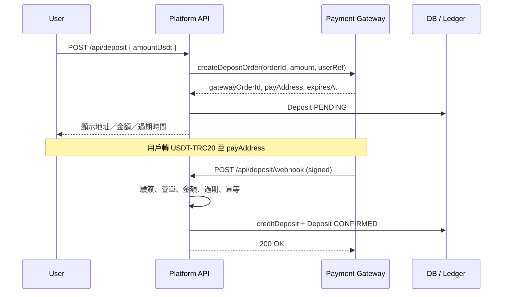
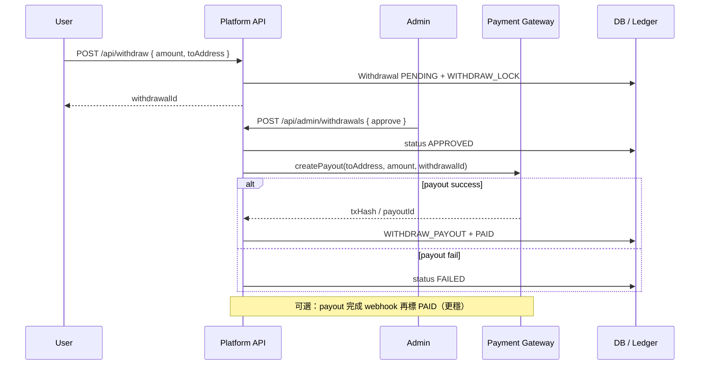

# USDT Payment Gateway 接入設計（cyber888.win）

> 範圍：接**第三方 payment gateway**（不自建掃鏈／熱錢包）。  
> 對齊現有 stub：`src/lib/providers/usdt-gateway.ts`、`/api/deposit/*`、`/api/withdraw`、`/api/admin/withdrawals`、ledger idempotency。  
> 本文只定設計；**不接真供應商、不大改業務代碼**。

---

## 1. 推薦接法（MVP）

| 流向 | 流程 |
|------|------|
| **入金 Deposit** | 用戶下單 → 我方建 `Deposit` → 調 gateway **create order** → 回傳收款地址／金額／過期時間 → 前端展示 → gateway 掃到鏈上款 → **webhook** → 驗簽／核對金額／冪等 → `creditDeposit` 入帳 |
| **提現 Withdrawal** | 用戶申請 → 鎖碼（`WITHDRAW_LOCK`）→ 狀態 `PENDING` → **Admin 人手批** → 調 gateway **payout API** → 成功則 `WITHDRAW_PAYOUT` + `PAID`；失敗則 `FAILED`（可重試／人工處理）；拒絕則 `WITHDRAW_RELEASE` + `REJECTED` |

**原則**

- 鏈上確認、地址分配、出金廣播一律由 gateway 負責；我方只存訂單與帳本。
- Ledger（`src/lib/ledger.ts`）為單一真相來源；gateway 只觸發狀態遷移，不直接改 `Wallet`。
- 提現 MVP **必須人手批**；`AUTO_WITHDRAW_LIMIT_MICROS`（≤1000 USDT）預留日後自動出款 worker，本期不啟用。

---

## 2. 我方 API／狀態機

### 2.1 既有 HTTP 接口（保持路徑）

| Method | Path | 職責 |
|--------|------|------|
| `POST` | `/api/deposit` | 建入金單；內部調 `createDepositOrder` |
| `GET` | `/api/deposit` | 用戶入金歷史 |
| `POST` | `/api/deposit/webhook` | Gateway 確認回調 → 入帳 |
| `POST` | `/api/withdraw` | 申請提現 + lock |
| `GET` | `/api/withdraw` | 用戶提現歷史 |
| `GET` | `/api/admin/withdrawals` | Admin 待審列表 |
| `POST` | `/api/admin/withdrawals` | `approve` / `reject` |

### 2.2 Deposit 狀態機

現有 enum：`PENDING` → `CONFIRMED` | `EXPIRED`

```
PENDING ──(webhook confirmed + 金額相符 + 未過期)──► CONFIRMED
PENDING ──(expiresAt 已過，webhook 或排程標記)──────► EXPIRED
CONFIRMED / EXPIRED ──(終態，忽略重複 webhook)──────► no-op
```

| 狀態 | 含義 | Ledger |
|------|------|--------|
| `PENDING` | 已派地址，等鏈上／gateway 確認 | 無 |
| `CONFIRMED` | 已確認 | `DEPOSIT`（`idempotencyKey = deposit:{txHash}`） |
| `EXPIRED` | 逾時未付或拒絕過期回調 | 無 |

### 2.3 Withdrawal 狀態機

現有 enum：`PENDING` → `APPROVED` | `REJECTED` | `PAID` | `FAILED`

```
PENDING ──reject──► REJECTED
PENDING ──approve──► APPROVED ──(gateway payout OK)──► PAID
                              └──(payout fail)──────► FAILED
```

| 狀態 | 含義 | Ledger |
|------|------|--------|
| `PENDING` | 待審 | 建立時 `WITHDRAW_LOCK` |
| `APPROVED` | 已批、出金中（調 gateway 前後） | 無額外分錄 |
| `REJECTED` | 拒批 | `WITHDRAW_RELEASE` |
| `PAID` | 出金成功 | `WITHDRAW_PAYOUT`（`idempotencyKey = withdraw-payout:{withdrawalId}`） |
| `FAILED` | gateway 出金失敗 | 鎖碼仍保留，等人工／重試 |

**與現 stub 差異**：Admin `approve` 目前直接 `fakeTxHash` → `PAID`。真接後應改為：`PENDING` → `APPROVED` → 調 payout → 成功 `PAID`（或 payout webhook → `PAID`）。見「建議改動」。

---

## 3. Sequence（Mermaid）

### 3.1 入金



### 3.2 提現（人手批 + payout）



---

## 4. Webhook 安全

對齊現有 `/api/deposit/webhook`，真接時強化如下：

| 項目 | 要求 |
|------|------|
| **認證** | Header secret（現：`x-gateway-secret`）或供應商 HMAC（`timestamp + body`）；用 `safeEqual` 比對，防 timing |
| **Secret** | `USDT_GATEWAY_WEBHOOK_SECRET`；僅伺服器持有；輪換時可短暫雙密 |
| **冪等** | ① Deposit 已 `CONFIRMED` → `200 { duplicate: true }`；② Ledger `deposit:{txHash}` unique；③ `txHash` 欄位 unique |
| **金額核對** | webhook `amountUsdt` → micros **必須等於** `Deposit.amountMicros`；不符 → 400，不入帳 |
| **訂單綁定** | 以 `gatewayOrderId` 查單；找不到 → 404 |
| **過期單** | `expiresAt < now` → 標 `EXPIRED`，拒絕入帳（現有邏輯保留） |
| **狀態白名單** | 僅接受供應商「最終成功」狀態（現 stub：`status: "confirmed"`）；pending／failed 不入帳 |
| **重放** | 若改 HMAC：校驗 timestamp 窗口（例如 ±5 分鐘）+ nonce／事件 id（若供應商提供） |
| **回應** | 成功／重複一律 2xx，避免供應商無意義重試風暴；業務拒絕用 4xx |

**提現 webhook（可選第二期）**：`payout.completed` / `payout.failed` → 遷移 `APPROVED` → `PAID` / `FAILED`；冪等鍵用 `withdraw-payout:{withdrawalId}` 或 `payout:{gatewayPayoutId}`。

---

## 5. 環境變數清單

| 變數 | 用途 | 現況 |
|------|------|------|
| `USDT_GATEWAY_WEBHOOK_SECRET` | 入金 webhook 共享密鑰 | ✅ `.env.example` 已有 |
| `USDT_GATEWAY_API_KEY` | Gateway REST 認證 | 待加 |
| `USDT_GATEWAY_API_SECRET` | 簽名／HMAC（若需要） | 待加 |
| `USDT_GATEWAY_BASE_URL` | API endpoint（含 sandbox URL 切換） | 待加 |
| `USDT_GATEWAY_MERCHANT_ID` | 商戶號（若供應商要求） | 待加 |
| `USDT_GATEWAY_CALLBACK_URL` | 對外 webhook URL（註冊給供應商） | 待加／文件化 |
| `USDT_GATEWAY_CHAIN` | 預設 `TRC20` | 可硬編碼 MVP |
| `USDT_GATEWAY_ASSET` | 預設 `USDT` | 可硬編碼 MVP |
| `USDT_GATEWAY_DEPOSIT_TTL_MINUTES` | 入金單過期（預設 30） | 可選 |
| `USDT_GATEWAY_MIN_DEPOSIT_USDT` | 最低入金（對齊 UI／zod） | 可選 |
| `USDT_GATEWAY_MIN_WITHDRAW_USDT` | 最低提現 | 可選 |

`.env` / secrets **永不入 git**；文件只列名稱。

---

## 6. 選供應商 Checklist

簽約／POC 前必須問清：

- [ ] **TRC20 USDT** 是否一等公民支援（非僅 ERC20）
- [ ] 入金：是否 **一單一址** 或共用池 + memo／amount matching
- [ ] 入金確認：幾次 confirmation、webhook 延遲、是否保證 `amount` 精確到小數位
- [ ] **手續費**：deposit／payout 誰付、是否從到帳金額扣、是否有固定費 + 百分比
- [ ] **最低／最高額**（deposit & withdraw）
- [ ] **提現／Payout API**：是否有程式化出金、狀態查詢、取消、失敗原因碼
- [ ] **Sandbox／Testnet** 或 mock 環境；webhook 可否手動重放
- [ ] Webhook：**簽名算法**、header 名稱、重試策略、IP allowlist
- [ ] 冪等：供應商事件 id、我方 `merchantOrderId` 是否可回傳
- [ ] 合規／地區：是否接受 gaming／offshore；KYC 要求落在誰
- [ ] SLA、對帳報表、客服時效、異常充值（少付／多付／過期後付款）政策
- [ ] 結算幣種與餘額：商戶帳戶是否需預存 USDT 作出金 float

---

## 7. 同現有 Stub 點樣替換

**保留不動（核心）**

- `src/lib/ledger.ts`：`creditDeposit` / `lockWithdrawal` / `releaseWithdrawal` / `payoutWithdrawal` 及 idempotency
- Prisma：`Deposit` / `Withdrawal` / `LedgerEntry` 模型主體
- 路由路徑與前端呼叫契約（回傳欄位名盡量不變）

**替換／擴充點**

| 檔案 | 動作 |
|------|------|
| `src/lib/providers/usdt-gateway.ts` | 實作真 HTTP：`createDepositOrder`；新增 `createPayout` / `verifyWebhookSignature`；刪除或隔離 `fakeTxHash` 於 dev-only |
| `src/app/api/deposit/route.ts` | 幾乎不變；繼續調 adapter，寫入 `Deposit` |
| `src/app/api/deposit/webhook/route.ts` | 改為供應商 payload schema + 真簽名；**保留**金額／過期／冪等／`creditDeposit` |
| `src/app/api/withdraw/route.ts` | 不變（申請 + lock） |
| `src/app/api/admin/withdrawals/route.ts` | `approve`：改調 `createPayout`；成功才 `PAID`；失敗 `FAILED`；勿再同步假 tx |
| `.env.example` | 補上第 5 節變數 |
| Prisma（可選） | `Withdrawal` 加 `gatewayPayoutId`；狀態流經 `APPROVED` |

**Adapter 建議介面（對齊現有 + 提現）**

```ts
createDepositOrder(input) → CreateDepositOrderResult  // 已有
createPayout(input: {
  withdrawalId: string;
  amountUsdt: number;
  toAddress: string;
}) → { gatewayPayoutId: string; txHash?: string; status: "submitted" | "paid" | "failed" }

verifyWebhook(req: Request) → GatewayWebhookPayload  // 取代單純 header secret（或包一層）
```

---

## 8. MVP 不做咩

- 自建掃鏈、自管熱／冷錢包、multisig
- 多鏈（ERC20／BEP20 等）；僅 **USDT-TRC20**
- 自動出金 worker（即使 ≤1000 USDT）
- 少付／多付自動補差或找零；不符金額一律拒入帳，人工處理
- 入金地址回收／地址池複雜策略（跟供應商預設即可）
- 用戶端鏈上瀏覽器深度整合、即時 mempool 推送（可日後加 status poll）
- 完整對帳後台、雙向調帳 UI（可先 CSV／供應商後台）
- 法幣通道、換匯

---

## 9. 建議改動（細小接口調整，實作時再做）

1. **Admin approve 狀態拆分**：`PENDING` → `APPROVED` →（payout）→ `PAID` / `FAILED`；避免批准當下假冒 `PAID`。現 stub 跳過 `APPROVED`。
2. **`Withdrawal` 欄位**：加可選 `gatewayPayoutId String?`、`failReason String?`，方便查單與重試。
3. **Webhook payload**：擴成可選 `eventId`／`paidAt`；簽名改 `verifyWebhook` 統一入口，路由只做業務。
4. **過期處理**：補輕量 cron／on-read 將逾時 `PENDING` 標 `EXPIRED`（webhook 路徑已有，列表讀取時可補）。
5. **金額容差**：供應商若以「實際到帳」回報且可能扣 fee，需在合約中定清：以訂單額核對 vs 以淨額入帳；MVP 建議**訂單額嚴格相等**，fee 由商戶帳戶承擔並在供應商側扣。
6. **`createDepositOrder` 輸入**：可加 `callbackUrl` / `clientIp`（若供應商需要）；不破壞現有回傳 shape。
7. **Dev simulate**：保留 `fakeTxHash` + 本地 secret webhook，用 `NODE_ENV !== "production"` 或獨立 flag 閘住，避免誤入 prod。

---

## 10. 對照現有 Stub（速查）

| 能力 | Stub 行為 | 真接後 |
|------|-----------|--------|
| 派址 | 本地偽 TRON 地址 | Gateway create order |
| 入帳 | Header secret + 手打 webhook | 供應商簽名 webhook |
| 提現批核 | Admin 立即假 tx → PAID | Admin 批 → payout API → PAID |
| 冪等 | `deposit:{txHash}` / `withdraw-payout:{id}` | **原樣保留** |

---

*文件版本：2026-07-28 · 平台路徑 `platform/` · 品牌 cyber888.win*
